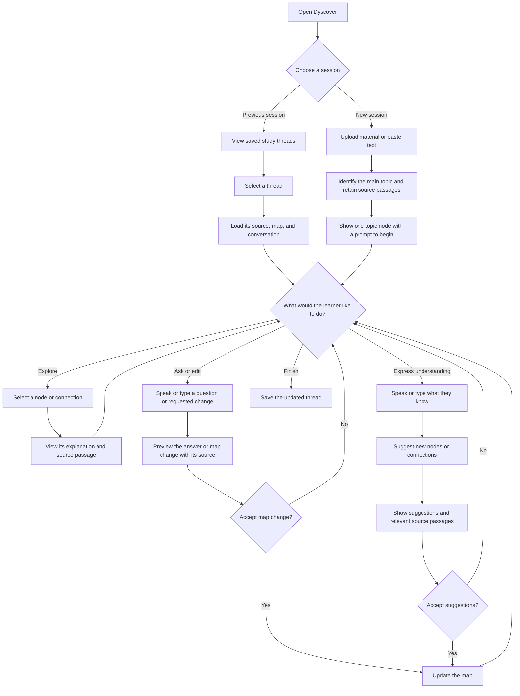

```mermaid
flowchart TD
    A[Open Dyscover] --> B{Choose a session}

    B -->|New session| C[Upload material or paste text]
    C --> D[Identify the main topic and retain source passages]
    D --> E[Show one topic node with a prompt to begin]

    B -->|Previous session| H[View saved study threads]
    H --> I[Select a thread]
    I --> J[Load its source, map, and conversation]
    J --> F

    E --> F{What would the learner like to do?}

    F -->|Explore| G[Select a node or connection]
    G --> K[View its explanation and source passage]
    K --> F

    F -->|Ask or edit| L[Speak or type a question or requested change]
    L --> M[Preview the answer or map change with its source]
    M --> N{Accept map change?}
    N -->|Yes| O[Update the map]
    N -->|No| F
    O --> F

    F -->|Express understanding| P[Speak or type what they know]
    P --> Q[Suggest new nodes or connections]
    Q --> R[Show suggestions and relevant source passages]
    R --> T{Accept suggestions?}
    T -->|Yes| O
    T -->|No| F

    F -->|Finish| S[Save the updated thread]
```
